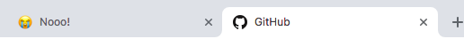
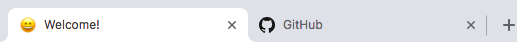

Welcome to changeIcon.js
===================


changeIcon.js is a small favicon changer library that uses event emitters

----------




Documentation
-------------
### Basic Usage
```javascript
changeIcon.addAction("initial" ,"Welcome!" ,"favicon.ico");
// Emit the action anytime you want
changeIcon.emitAction("initial");
```
You can emit "added actions" as much as you want

### Other functions

#### changeIcon.onAnotherTab(*title*,*source*)
Changes the icon and title when user switches to another page

```javascript
changeIcon.onAnotherTab("Noooo!" ,"crying.ico");
```
#### changeIcon.onThisTab(*callback*)
Executes the callback when user turns to the page

```javascript
changeIcon.addAction("initial","WelcomeBack!","smiling.ico");

changeIcon.onThisTab(() => {
	changeIcon.emitAction("initial");
});
```
#### changeIcon.emitAction("original")
That one is a special emitter that turns the title and the icon to their original state

### License / Credits

changeIcon.js is released under the MIT license.
